# A Direct Neighborhood Combination of the Adjacency Matrix for Graph Learning

## Overview
A easily implemented neighborhood combination for common graph learning including supervised&semi-supervised graph classification,
graph link prediction, graph edge generation$classification. The proposed approach improve the performance of several graph models,
such as GCN, GIN,LDS-GNN,GMNN,PWL,GRAPH_Unet, Graphite, VGAE, MGCNK and etc al. It's an official implementation of the Paper[A Direct
Neighborhood Combination of the Adjacency Matrix for Graph Learning] based on several graph model implementation such as

# Stay Tune for More Experiments.
# Experiment No1:Supervised Graph Classification in Comparison with GCN and GIN on 7 Datasets

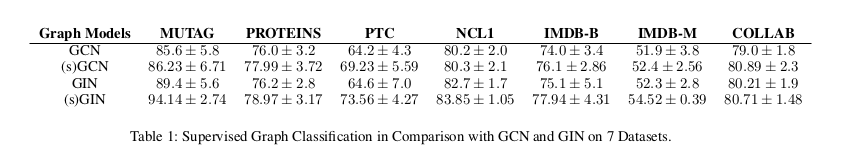

# Experiment No2:Supervised Graph Classification in Comparison with KNN-LDS on 6 Datasets.

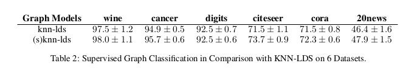

# Experiment No3:Supervised Graph Classification in Comparison with P-WL and its variants on 2 Datasets.

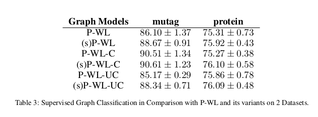

# Experiemtn No4:Semi-Supervised Graph Classification in Comparison with GMNN on 3 Datasets.

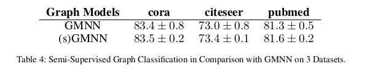

# Experiment No5:Graph Link Prediction.

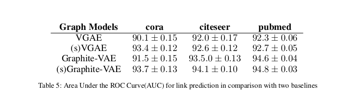

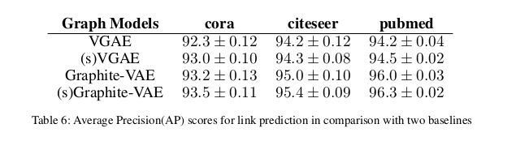

# Experiemtn No6:Edge Generation&Graph Classification.

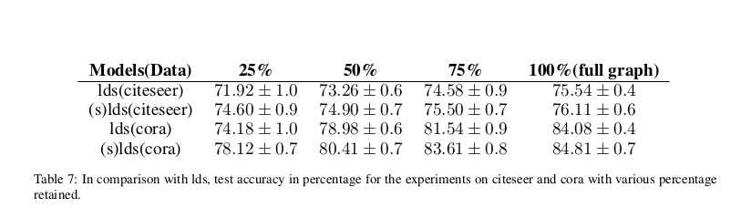

# Experiemtn No7:Graph Classification with node attribute.

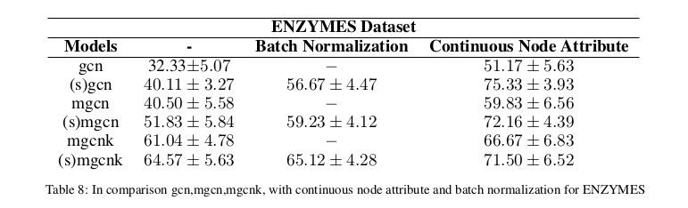

# Experiemtn No8:Graph Classification in Comparison with GCN,MGCN,MGCNK.

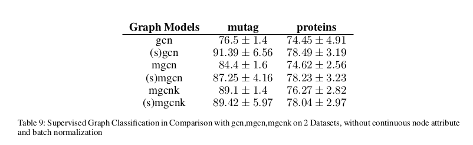

# Experiemtn No9:Supervised Graph Classification in Comparison with two transformation forms and two baseline models.

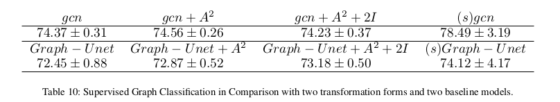

# Experiemtn No10:Supervised Graph Classification for Three Datasets Comparing Mixhop and (s)gmnn.

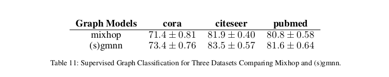

# Experiemtn No11:Supervised Graph Classification in Comparison with state-of-the-art models on 13 Datasets.

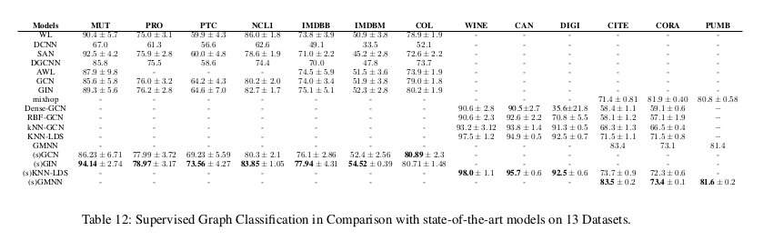

